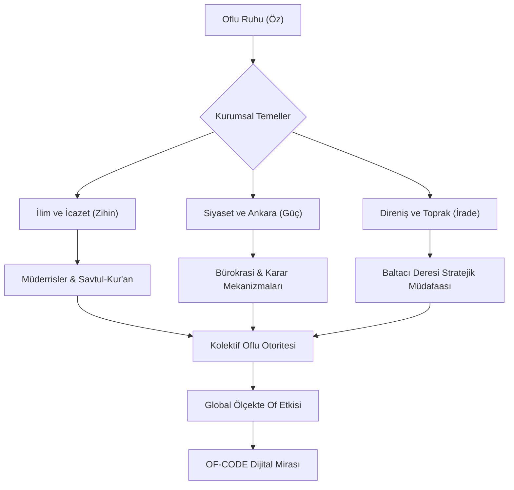
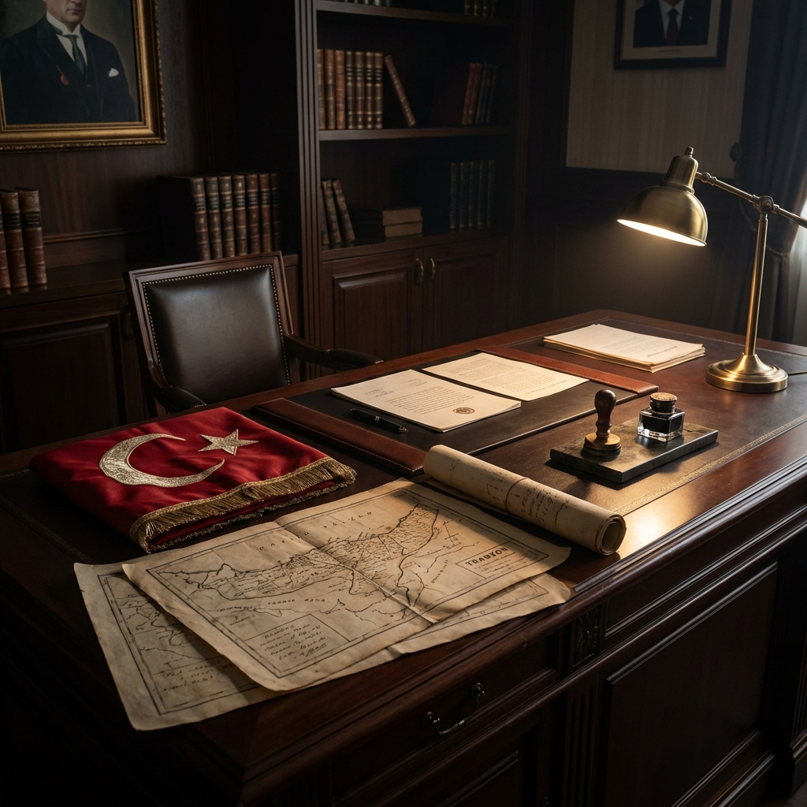
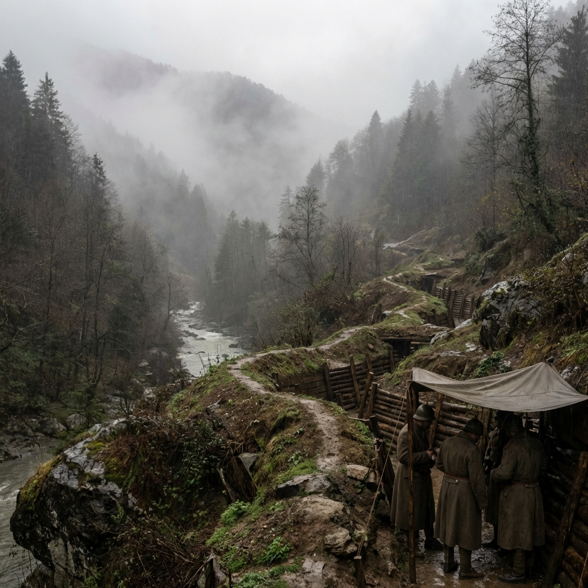



  
  
  # ⚓ OF-CODE: Otorite, İlim ve Üstün İrade
  
  
  
  
  > **"Of bir coğrafya değil, bir dünya görüşüdür; bir duruş, bir itiraz ve nihayetinde bir idaredir. Of merkezleşmiş bir irade, aklın direnişe dönüştüğü yegâne noktadır."**
  
  Karadeniz’in en keskin zekâlı, en gelenekçi ve devlet yönetiminde en etkili noktalarında bulunan "Of" ruhunun tarihsel, sosyolojik ve stratejik dijital arşivi. Bu repository, sadece Karadeniz kıyısındaki bir yerleşkeyi değil; yüzyıllardır süregelen bir yönetim doktrini, sarsılmaz bir iradeyi ve asırlık bir eğitim geleneğini çağdaş teknolojik standartlarla (Architecture-as-Code) gelecek asırlara mühürlemektedir. Burada kodlanan her veri, Karadeniz’in sert rüzgarıyla bilenmiş, Solaklı Deresi'nin hırçınlığıyla mayalanmış bir pratik zeka ürünüdür ve bu birikim, dijital çağın gerekliliklerine göre yeniden derlenmiştir.

---

## 🧭 Proje Vizyonu: Oflu Genomunun Şifreleri

**OF-CODE**, antik çağların gizeminden modern Türkiye’nin bürokratik koridorlarına kadar Of’un geçirdiği muazzam dönüşümü, bir bölgenin nasıl "Devletin Sarsılmaz Kalesi, Hafıza İçinde Tarih" haline geldiğini akademik ve sosyolojik titizlikle inceler. Of; ulemasıyla ilmi otoriteyi, siyasetçisiyle devletin çelik çekirdeğini, iş dünyasındaki sarsılmaz ağırlığıyla ekonomik pragmatizmi ve kendine has "keskin, hazırcevap ve otoriter" mizahıyla hayatın bizzat kendisini tanımlar. Bu coğrafya, sıradan bir taşra ilçesi olmanın çok ötesinde, Türkiye'nin sosyal ve siyasal hayatına yön veren gizli bir başkent, bir "Decision Center" (Karar Merkezi) işlevi görmektedir.

Bu projenin temel vizyonu, yüzeysel şehir efsanelerinin ve basmakalıp anlatıların ötesine geçerek **"Oflu Entelektüel Sermayesi"**ni ve kültürel kodlarını yapısal, analitik ve mühendislik disipliniyle ele alınmış bir dille analiz etmektir. Of, bir ilçe olmanın çok ötesinde, toplumsal bir direncin ve yönetimsel bir dehanın dünya üzerindeki merkez üssüdür. Biz burada, o "bize her yer Trabzon" sloganının altındaki derin felsefi ve stratejik altyapıyı, yani "neden ve nasıl" sorularının cevabını kodluyoruz. Bu proje, Oflu'nun sadece ne yaptığını değil, nasıl düşündüğünü (Algorithm of Thought) deşifre etmeyi amaçlar.

### 🧬 Çekirdek Değerler (Kernel Values)

*   **Mutlak Otorite (Absolute Authority):** Hiyerarşiye duyulan saygı ve liderlik vasfının doğal kabulü, Of toplumunun en belirgin özelliğidir. Aile reisinden devlet baskanına kadar uzanan bu silsilede, herkes yerini ve görevini "System Kernel" seviyesinde bilir ve ona göre hareket eder. İtaat, bir zorunluluk değil, sistemin sağlıklı işlemesi için gereken bir ön koşuldur.
*   **Pratik Zeka (Runtime Intelligence):** Sorunlar karşısında anlık, yaratıcı ve bazen kuralları esneten çözüm üretim kapasitesi, Oflu zekasının "Runtime" performansını gösterir. Kitabi bilginin bittiği yerde devreye giren bu zeka türü, en karmaşık krizleri bile bir çırpıda çözebilecek (Hotfix) kıvrak manevralara sahiptir.
*   **Sarsılmaz İnat (Immutable Will):** Bir Karar (Decision) bir kez alındığında, onu değiştirebilecek hiçbir dış faktörün olmaması (Read-Only Memory) durumu. Bu, sıradan bir inatçılık değil, doğruluğuna inanılan bir davanın sonuna kadar savunulmasıdır. Oflu için geri adım atmak, sistemin çökmesi (System Failure) ile eşdeğerdir.
*   **Kolektif Dayanışma (Cluster Architecture):** Dünyanın neresinde olursa olsun, iki Oflu'nun bir araya geldiğinde oluşturduğu yıkılmaz network ağı. Bu "Cluster", herhangi bir merkezi sunucuya ihtiyaç duymadan, birbirini bulan node'lar (bireyler) üzerinden anında veri ve kaynak paylaşımına başlar. Bu ağ, dünyanın en güvenli ve en hızlı iletişim protokolüdür.

### 📜 Of'un Yazılı Olmayan Anayasası (The Governance Protocol)

Of toplumunu ayakta tutan ve yüzyıllardır değişmeyen, kağıda dökülmemiş ama herkesin zihnine kazınmış (Hardcoded) temel yasalar vardır. Bu yasalar, sosyal düzenin "Kernel" seviyesindeki kurallarıdır:

1.  **Madde 1 - Hiyerarşik Bütünlük (Integrity Check):** Büyüğün sözü, sistemin "Root" komutudur. Tartışılamaz, sorgulanamaz (Sudo Access Required). Bir mecliste yaşça veya ilimce büyük olan konuştuğunda, diğer tüm process'ler (işlemler) "Suspend" moduna geçer.
2.  **Madde 2 - Liderlik Prensibi (Master Node Selection):** Her toplulukta, herailede ve her grupta mutlaka bir "Reis" vardır. Başsız (Headless) bir yapı, Oflu için kaos demektir. Lider, kriz anında tüm yükü (Load Balancing) üzerine alan ve rotayı çizen kişidir.
3.  **Madde 3 - Sadakat Protokolü (Handshake Verification):** Dosta güven, düşmana korku. Kurulan bir bağ (connection), karşı taraf ihanet etmediği sürece "Keep-Alive" sinyali göndermeye devam eder. Oflu dostluğu, düşük gecikmeli (Low Latency) ve yüksek bant genişlikli (High Bandwidth) bir veri yoludur.
4.  **Madde 4 - Çözüm Odaklılık (Bug Fixing):** "Olmaz" diye bir şey yoktur, "Henüz denenmemiş bir yöntem" vardır. Bir Oflu için imkansız, sadece biraz zaman alan bir "Derleme Süreci"dir (Compilation Time). Mevzuat izin vermiyorsa, mevzuat "Refactor" edilir.
5.  **Madde 5 - Vatan Savunması (Firewall Rules):** Söz konusu vatan veya namus olduğunda, tüm bireysel anlaşmazlıklar askıya alınır ve yekvücut bir savunma duvarı (Firewall) örülür. Bu duvardan sızmak (Intrusion) imkansızdır.

---

## 🏛️ Mimari Akış: Otoritenin Katmanları

Of'un toplumsal ve yönetimsel yapısı, dışarıdan bakıldığında karmaşık görünse de, kendi içinde mükemmel işleyen dağıtık ama merkeziyetçi bir mimariye (Distributed but Centralized Architecture) benzer. Her birey otonom bir birim gibi hareket etse de, "Büyük Of Vizyonu"na (Mainframe) görünmez bağlarla bağlıdır ve kolektif bilince hizmet eder.

---

## 📂 Repository Mimarisi: Stratejik Modüller

Aşağıdaki dizinler projenin ana omurgasını teşkil eder ve her biri Of'un birer "mükemmeliyet merkezi" olan uzmanlık alanlarını temsil eder. Her modül, kendi içinde derinlemesine bir küülliyatı barındırır:

*   [**📜 01_İlim_Hafizasi/**](01_Ilim_Hafizasi/) - **(Kernel Modülü):** "Karadeniz'in Al-Azhar'ı" olarak bilinen Of'un derin ilmi mirası. Sadece dini eğitim değil, toplumsal hukuku (Fıkıh) düzenleyen ulema disiplini ve icazet sisteminin kodları. Solaklı Vadisi boyunca uzanan medrese zincirinin haritalanması. Bu modül, yüzlerce yıldır sönmeyen kandillerin ışığında yazılan el yazmalarını, icazet silsilelerini ve bu "İlim Vadisi"nin nasıl bir akademi gibi çalıştığını belgeler.
*   [**🏛️ 02_Siyaset_Laboratuvari/**](02_Siyaset_Laboratuvari/) - **(Control Plane):** Devlet mekanizmasındaki "Oflu Ağırlığı"nın anatomisi. Bakanlar, müsteşarlar, genel müdürler ve Türk bürokrasisindeki "Oflu Kadroculuk" geleneğinin sosyolojik analizi. Ankara'daki "Devlet Adamı Ekolü" gerçeğinin rasyonel incelemesi. Neden en kritik koltuklarda hep bir Oflu oturur? Bu sorunun cevabı, tesadüflerde değil, yüzyıllık bir devlet terbiyesi ve yönetim geleneğinde (Governance Protocol) saklıdır.
*   [**⚔️ 03_Milli_Mucadele/**](03_Milli_Mucadele/) - **(Defense System):** 1916 Rus işgaline karşı serpilen "Milis İradenin" teknik dokümanları. Baltacı Deresi'nde durdurulan imparatorluk ordusunun ve o günkü gerilla taktiklerinin detaylı dökümü. Düzenli orduların dağıldığı bir dönemde, sarıklı müderrislerin önderliğinde kurulan bu sivil savunma hattı, modern harp tarihine "Asimetrik Savaş" dersi olarak geçecek niteliktedir.
*   [**🌊 04_Sosyal_Yapi/**](04_Sosyal_Yapi/) - **(Network Topology):** Mikrososyobiyolojik bir analiz: Sülale Federasyonları. Sarıalioğulları, Çakıroğulları, Nuhoğulları ve diğer büyük ailelerin toplumsal hiyerarşideki rolleri ve "Ağalık" kurumunun modern izdüşümleri. Bu yapı, kan bağının ötesinde, bir "Sözleşme Hukuku" gibi işleyen, yazılı olmayan ama herkesin harfiyen uyduğu toplumsal kontratları ve hiyerarşi protokollerini (Handshake Protocols) içerir.
*   [**📖 05_Of_Lügatı/**](05_Of_Lugati/) - **(Communication Protocol):** Of ağzının matematiksel ve pratik grameri. Karşısındakini tek bir hazırcevapla "bypass" eden linguistik sanat, bölgeye özgü deyimler ve racon kuralları. "Haçan", "Ula", "Cenik" gibi anahtar kelimelerin (keywords) semantik derinliği. Bu dil, az kelimeyle çok şey anlatan, duygu ve düşünceyi en kestirme yoldan (Low Latency) ileten optimize edilmiş bir iletişim sürümüdür.
*   [**🏗️ 06_Ekonomik_Ecosystem/**](06_Ekonomik_Ecosystem/) - **(Resource Management):** İnşaat imparatorluklarından çay bahçelerine uzanan ekonomik tahakküm. Türkiye'nin imarındaki Oflu müteahhit 'design pattern'ları. Bir Oflu'nun eline mala ve çekiç verildiğinde, sadece bir bina değil, koca bir şehir inşa edebilir. Bu modül, zorlu coğrafyadan kazanılan "Taşı Sıksa Suyunu Çıkarma" yeteneğinin nasıl küresel bir ekonomik güce dönüştüğünü inceler.

---

## 🏛️ Stratejik Odak Noktaları: Derinlemesine Of

### 📜 Ulema ve Eğitim Mirası: Medreseler Şehri

  

Of, Osmanlı klasik döneminden bugüne Karadeniz’in en prestijli "İlmi Havzası" olmuştur. Of medreseleri, sadece kurra hafızlar değil, aynı zamanda toplumun her kesimine hükmeden, adaleti tesis eden hukukçular (müftüler, kadılar) ve sosyal barışı sağlayan kanaat önderleri yetiştirmiştir. "Of'ta her ev bir medresedir" sözü, bu bölgenin bilgiye olan genetik bağlılığını özetler. İstanbul'daki Fatih Medreseleri ile yarışan, hatta zaman zaman oraya müderris ihraç eden bu yapı, ilmin sadece teorik değil, toplumsal düzeni sağlayan pratik bir araç (Utility) olarak nasıl kullanıldığının en canlı örneğidir.

*   **Ulema Disiplini:** Köy odalarından çıkan dünya çapındaki alimlerin yetişme şartları, Savtul-Kur'an geleneği ve icazetin sarsılmaz ağırlığı. Bu disiplin, sabah namazından yatsıya kadar süren, ezber, mütalaa ve müzakere ile yoğrulmuş, çelik gibi sinirler gerektiren bir eğitim sürecidir (Rigorous Training).
*   **Sosyal Hukuk:** Oflu hocaların sadece camide değil, pazarda, tarlada ve devlet katında çözüm üreten "Fıkhi Pratikliği". Onlar, karmaşık arazi anlaşmazlıklarını veya kan davalarını, modern mahkemelerden daha hızlı ve kalıcı bir şekilde çözen "Arabulucu Algoritmalar" (Mediator Algorithms) geliştirmişlerdir.
*   **Solaklı Vadisi Ekolü:** Vadik boyunca her kilometrede bir değişen ama özünde aynı ilmi disiplini barındıran eğitim network'ü. Bu vadi, adeta bir silikon vadisi gibi, ama teknoloji değil "İlim ve İrfan" üreten bir üretim bandı (Assembly Line) gibi çalışmıştır.

### 🎖️ Siyaset ve Devlet Hafızası: Karar Odası Of

  

Türkiye Cumhuriyeti'nin yönetim şemasında "Of" bir imzadır. Of; güvenin, sadakatin ve sarsılmaz yönetme iradesinin kalesidir. Devletun en kritik virajlarında dümende hep bir Oflu’nun olması tesadüf değil, bir yönetim doktrininin sonucudur. Oflular, devlet mefhumunu kutsal bir emanet olarak görür ve bu emaneti korumak için her türlü fedakarlığı yapmaktan çekinmezler. Onlar için makam bir amaç değil, devlete hizmet etmek için ele geçirilmesi gereken stratejik bir mevzidir (Strategic Position).

*   **Oflu Lobisi ve Liyakat:** Ankara’daki "Of Gücü"nün aslında bir "Güven ve Dayanışma Ağı" olarak nasıl işlediği, devletin bekası için alınan kararlardaki Oflu imzası. Bu lobi, kişisel çıkarların ötesinde, memleketin ali menfaatleri için çalışan, görünmez ama hissedilir bir "Senato" gibi hareket eder.
*   **İdari Üstünlük:** Sadece siyaset değil, sendikalardan spor kulüplerine, sivil toplumdan iş dünyasına kadar her alanda kurulan "İdari Hakimiyet". Bir yönetim kurulunda Oflu varsa, başkanın kim olduğunun önemi yoktur; fiili otorite ve son söz hakkı (Final Commitment) her zaman o Oflu'dadır.
*   **Bakanlar Üreten Toprak:** Kabine revizyonlarında değişmeyen tek parametre olarak Oflu temsiliyeti. Hangi parti iktidar olursa olsun, Of'un "Bakan Çıkarma Kapasitesi" (Throughput) asla düşmez, her dönemde Ankara'da güçlü bir ses mutlaka yankılanır.

### ⚔️ Direnişin Tarihi: 110 Günlük Baltacı Deresi Destanı

  

1916 yılındaki Rus işgalinde sergilenen direniş, dünya savaş tarihindeki en büyük "Halk Mukavemeti" örneklerinden biridir. Koca bir İmparatorluk ordusu, düzenli bir askeri güç karşısında değil; tüfeğini kapan köylünün, ulemanın ve kadının kurduğu "İrade Hattı" karşısında durmak zorunda kalmıştır. Bu direniş, sadece askeri bir savunma değil, aynı zamanda toprağına, namusuna ve inancına sahip çıkan bir halkın topyekün kıyamıdır (Total Uprising).

*   **Stratejik Müdafaa:** Zisino (Bölümlü) ve Baltacı Deresi hattında kurulan doğal savunma mekanizmaları, gerilla tipi baskınlar ve Rus generallerini dahi hayrete düşüren lojistik zeka. Coğrafyanın zorluklarını bir savunma çarpanı (Defense Multiplier) olarak kullanan Oflular, düşmanı kendi kurallarıyla oynamaya zorlamış ve bataklığa çekmiştir.
*   **Bağımsızlık Geni:** Hiçbir yerden emir beklemeden vatanını savunan "Doğuştan Asker" Oflu karakterinin tarihsel tescili. Emir-komuta zinciri beklemeden, inisiyatif alarak cepheye koşan bu ruh, Of'un "Otonom Savunma Sistemi"nin (Autonomous Defense System) en büyük kanıtıdır.
*   **Sarıkamış'tan Of'a:** Kafkas cephesinin düşüşüne rağmen Of'ta gösterilen o son kale direnişi. Tüm cepheler çökerken Of'un direnmesi, "Bitti demeden bitmez" sözünün tarihsel karşılığıdır.

---

## ❓ Oflu SSS (Sıkça Sorulan Sorular / FAQ)

> **Q: Oflular neden her yerde yönetici konumundadır? (Permission Denied?)**  
> **A:** Oflu yaratılışı gereği "root" yetkileriyle doğar. Süper kullanıcı (Superuser) haklarına sahip olmak genetik bir mirastır. Yönetilmek (user mode) fıtratına aykırıdır; yönetmek, inisiyatif almak ve sorumluluk üstlenmek (admin mode) ise doğal yaşam alanıdır. Bir Oflu'yu sıradan bir personel olarak çalıştırmak, bir süper bilgisayarda "Notepad" açmak kadar verimsizdir.
>
> **Q: Oflu inadı bir 'bug' mıdır yoksa bir 'feature' mıdır?**  
> **A:** Kesinlikle sistemin en güçlü 'feature'ıdır. Bu inat (persistence), o kadar güçlüdür ki, hedefe ulaşana kadar sistemin kapanmamasını (no downtime) ve gerekirse sonsuz döngüde (infinite loop) çalışmasını sağlar. Vazgeçmek, geri dönmek veya "olmaz" demek, Oflu işletim sisteminde tanımlı olmayan, derleyici hatası (Compiler Error) veren komutlardır.
>
> **Q: Of'ta "Hayır" cevabı ne anlama gelir?**  
> **A:** Of lügatında "Hayır", asla bir ret cevabı değildir. Bu, "Henüz beni ikna edecek kadar yaratıcı ve kararlı davranmadın, lütfen argümanlarını güncelle ve tekrar dene" anlamına gelen bir 'challenge response' mekanizmasıdır. Bir Oflu'ya "Hayır" dedirtmek imkansızdır, sadece o an için "Beklemede" (Pending) statüsündesinizdir.

---

## 📉 Tarihsel Kilometre Taşları: Otoritenin Takvimi

| Zaman | Olay | Stratejik Sonuç |
| --- | --- | --- |
| **M.Ö. Antik** | İlk Yerleşimler | Bölgenin liman ve ticaret üssü (Port Mapping) olarak tanımlanması ve ilk stratejik öneminin fark edilmesi. |
| **1461** | Fatih'in Fethi | Bölgenin "İslam'ın ve İlmin Kalesi" olma yolundaki ilk büyük adımı ve Osmanlı idari sistemine entegrasyonu (System Integration). |
| **1600-1900** | İlim Çağı | Of'un, Osmanlı bürokrasisine en nitelikli ulemayı ihraç ettiği, medreselerin altın çağını yaşadığı (Golden Age) dönem. |
| **1916** | Baltacı Direnişi | "Vatan-ı Sani" (İkinci Vatan) bilinciyle toprağın milis kuvvetlerle mühürlenmesi ve işgalcilere "Access Denied" denilmesi. |
| **1923+** | Cumhuriyet Dönemi | Yeni devletin inşasında Oflu bürokrat ve siyasetçilerin "Kurucu Sistem Mühendisleri" olarak sahne alması ve rejimin temellerine harç koyması. |
| **1950 - Günümüz** | Modern Otorite | Oflu liderlerin Türkiye'nin kaderini belirleyen makamlarda mutlak hakimiyeti. İnşaat ve altyapı projeleriyle ülkeyi fiziken şekillendirmeleri (Physical Structuring). |
| **2026** | Dijital Miras | OF-CODE ile bu muazzam tarihin ve karakterin teknolojiyle geleceğe taşınması ve sonsuzluğa (Infinity) kodlanması. |

---

## 💾 Dijital Dönüşüm Metodolojisi: Ruhu Koda Dökmek

Biz bu projede, sadece eski resimleri tarayıp metne dökmedik; bir sosyolojiyi "Reverse Engineering" (Tersine Mühendislik) yöntemiyle analiz ettik ve dijital varlıklara dönüştürdük. Kullandığımız metodoloji şudur:

*   **Veri Madenciliği (Data Mining):** Kahvehanelerdeki sohbetlerden, yayla şenliklerindeki atışmalara kadar her türlü sözlü kültür öğesi, ham veri (Raw Data) olarak toplanmış ve anlamsal bütünlük (Semantic Integrity) süzgecinden geçirilmiştir.
*   **Algoritmik Analiz:** Oflu'nun bir olay karşısında verdiği tepkiler, karar ağaçlarına (Decision Trees) dökülmüş ve "Oflu Mantığı"nın (Logic of Of) akış şemaları çıkarılmıştır.
*   **Kapsülleme (Encapsulation):** Tarihsel olaylar, sadece kuru birer bilgi olmaktan çıkarılmış, içerdikleri duygu ve stratejiyle birlikte kapsüllenerek (Encapsulated) gelecek nesillere aktarılabilir nesneler (Objects) haline getirilmiştir.
*   **Sürekli Entegrasyon (CI/CD):** Kültür, durağan değildir. Yeni nesil Ofluların başarıları, modern dünyaya adaptasyonları ve global etkileri, sürekli olarak bu repoya "Push" edilmekte ve kültürün yaşayan bir canlı gibi güncel kalması sağlanmaktadır.

---

## 🛠️ Katkı Sağlama: Bir Mirası İnşa Etmek

Bu repository, yaşayan, nefes alan ve sürekli büyüyen dinamik bir organizmadır. Elinizdeki tozlu raflarda kalmış belgeleri, hafızanızın derinliklerindeki dede yadigarı hikayeleri ve atalarınızdan kalan o eşsiz kültürel kodları buraya ekleyerek bu devasa arşive katkıda bulunabilirsiniz. Dedelerinizden duyduğunuz o efsanevi direniş anılarını, kahvehane köşelerinde konuşulan derin siyasi anekdotları veya unutulmaya yüz tutmuş, sadece o vadiye özgü bir deyimi `fork` edip `pull request` göndererek bu mirasa dahil edin. Unutmayın, bilgi paylaştıkça çoğalır, ancak Oflu bilgisi paylaşıldıkça hem çoğalır hem de hükmeder.

Detaylar ve katkı rehberi için lütfen şu dokümanı inceleyin: [CONTRIBUTING.md](CONTRIBUTING.md)

---

## 👨‍💻 Geliştirici Hakkında

**Bahattin Yunus Çetin**  
*IT Architect / Stratejik Teknoloji Laboratuvarı Kurucusu / Of-Code Maintainer*

Trabzon'un kalbi Of'ta bir misafir, ancak Şereflikoçhisar’ın öz evladı. Akademik yolculuğunu Of'un derin ve köklü atmosferinde sürdüren, Tuz Gölü'nün dingin bilgeliğini Karadeniz'in hırçın dalgalarıyla harmanlayan bir BT Mimarı. Of’ta geçirdiği eğitim süreci, ona sadece akademik bilgi değil, aynı zamanda bu coğrafyanın 'Yönetim ve İrade' kodlarını (Administrative Kernel) yakından inceleme fırsatı sundu. Bir "gözlemci" (Observer) hassasiyetiyle, Of’un sosyal ve idari yapısını analiz eden, Şereflikoçhisar'ın vakur duruşunu Of'un pratik zekasıyla birleştiren bir teknoloji vizyoneri. O, bu projeyi hem bir vefa borcu hem de sosyolojik bir dijital arşivleme görevi olarak yürütmektedir.

---

## 📢 Motto

> **"Her yer Of, ama sadece Of merkezdir. Çünkü otorite yerinde, irade ise en derindedir."**

---

  

---

  
  
<i>Otorite ve İrade Arşivi - Milli Hafıza ve Kültür Merkezi - 2026</i>

