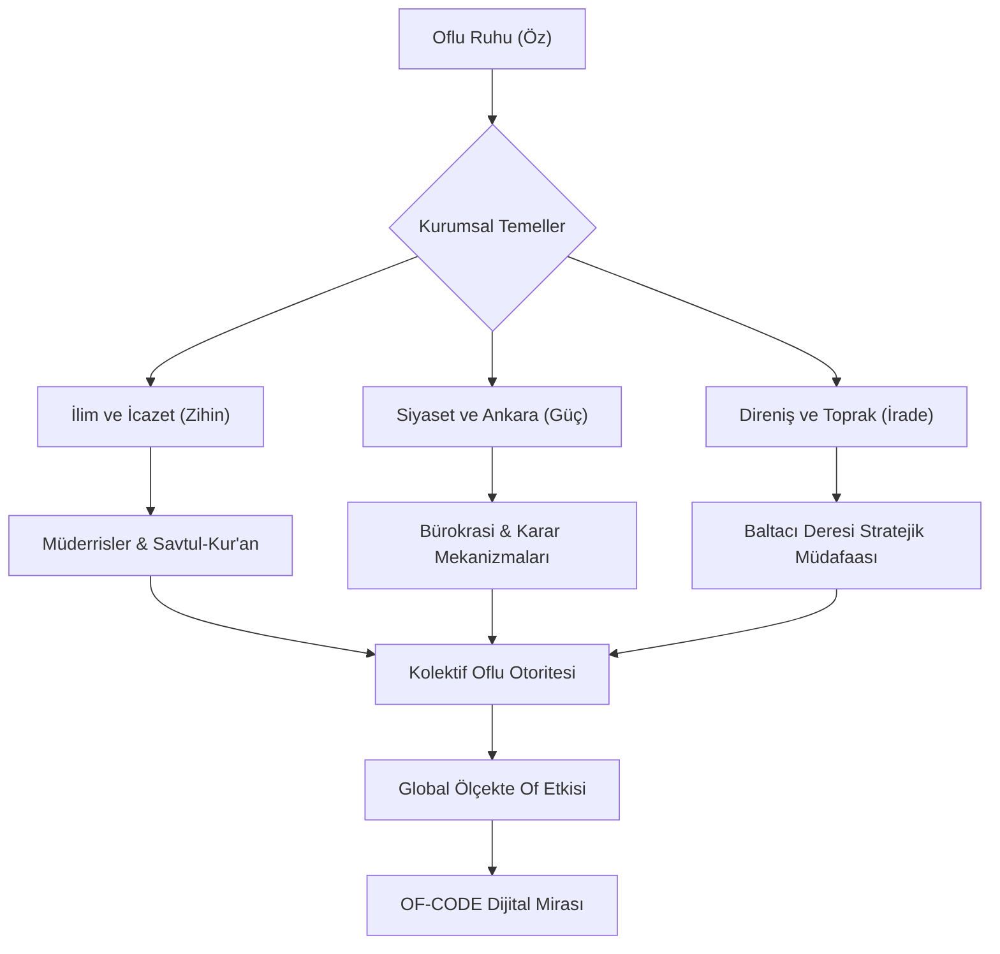



  
  
  # ⚓ OF-CODE: Otorite, İlim ve Üstün İrade
  
  
  
  
  > **"Of bir coğrafya değil, bir dünya görüşüdür; bir duruş, bir itiraz ve nihayetinde mutlak bir idaredir. Of merkezleşmiş bir irade, aklın saf direnişe dönüştüğü ve 'olmaz' kelimesinin sözlükten silindiği yegâne noktadır."**
  
  Karadeniz’in en keskin zekâlı, en gelenekçi ve devlet yönetiminde en etkili noktalarında bulunan eşsiz "Of" ruhunun tarihsel, sosyolojik ve stratejik dijital arşivi. Bu repository, sadece Karadeniz kıyısındaki fiziksel bir yerleşkeyi temsil etmekle kalmaz; aynı zamanda yüzyıllardır süregelen bir yönetim doktrini, sarsılmaz bir çelik iradeyi ve asırlık bir eğitim geleneğini çağdaş teknolojik standartlarla (Architecture-as-Code) birleştirerek gelecek asırlara mühürlemektedir. Burada kodlanan her bir bayt veri, Karadeniz’in sert rüzgarıyla bilenmiş, Solaklı Deresi'nin hırçınlığıyla mayalanmış ve yayla dumanıyla demlenmiş bir pratik zeka ürünüdür; bu birikim, dijital çağın gerekliliklerine göre yeniden derlenmiş (recompiled) ve optimize edilmiştir.

---

## 🧭 Proje Vizyonu: Oflu Genomunun Şifreleri

**OF-CODE**, antik çağların gizemli derinliklerinden modern Türkiye’nin bürokratik koridorlarının en tepe noktalarına kadar Of’un geçirdiği muazzam dönüşümü, bir bölgenin nasıl "Devletin Sarsılmaz Kalesi, Hafıza İçinde Tarih" haline geldiğini akademik ve sosyolojik bir titizlikle inceler. Of; ulemasıyla ilmi otoriteyi, siyasetçisiyle devletin çelik çekirdeğini, iş dünyasındaki sarsılmaz ağırlığıyla ekonomik pragmatizmi ve kendine has "keskin, hazırcevap, zeki ve otoriter" mizahıyla hayatın bizzat kendisini yeniden tanımlar. Bu coğrafya, haritada sıradan bir taşra ilçesi olarak görünmenin çok ötesinde, Türkiye'nin sosyal ve siyasal hayatına yön veren gizli bir başkent, görünmez bir "Decision Center" (Karar Merkezi) işlevi görmektedir.

Bu projenin temel vizyonu, sadece yüzeysel şehir efsanelerinin ve basmakalıp fıkra tadındaki anlatıların ötesine geçerek **"Oflu Entelektüel Sermayesi"**ni ve derin kültürel kodlarını yapısal, analitik ve mühendislik disipliniyle ele alınmış bir dille analiz etmektir. Of, bir ilçe olmanın çok ötesinde, toplumsal bir direncin, yönetimsel bir dehanın ve hayatta kalma sanatının dünya üzerindeki merkez üssüdür. Biz burada, o meşhur "bize her yer Trabzon" sloganının altındaki derin felsefi, sosyolojik ve stratejik altyapıyı, yani "neden ve nasıl" sorularının cevabını satır satır kodluyoruz. Bu proje, Oflu'nun sadece ne yaptığını değil, nasıl düşündüğünü, beyninin arka planında çalışan o karmaşık algoritmayı (Algorithm of Thought) deşifre etmeyi amaçlar.

### 🧬 Çekirdek Değerler (Kernel Values)

*   **Mutlak Otorite (Absolute Authority):** Hiyerarşiye duyulan sarsılmaz saygı ve liderlik vasfının en doğal haliyle kabulü, Of toplumunun en belirgin ve ayırt edici özelliğidir. Aile reisinden devlet baskanına, mahalle muhtarından kanaat önderine kadar uzanan bu silsilede, herkes yerini ve görevini "System Kernel" seviyesinde bilir ve ona göre hareket eder. İtaat, dayatılan bir zorunluluk değil, sistemin sağlıklı, hatasız ve uzun ömürlü işlemesi için gereken bir ön koşuldur (Prerequisite).
*   **Pratik Zeka (Runtime Intelligence):** Beklenmedik sorunlar karşısında anlık, yaratıcı, şaşırtıcı ve bazen fizik kurallarını bile esneten çözüm üretim kapasitesi, Oflu zekasının "Runtime" performansını gösterir. Kitabi bilginin bittiği ve teorinin tıkandığı yerde devreye giren bu zeka türü, en karmaşık krizleri bile bir çırpıda çözebilecek (Hotfix) ve sistemi yeniden ayağa kaldıracak kıvrak manevralara sahiptir.
*   **Sarsılmaz İnat (Immutable Will):** Bir Karar (Decision) bir kez alındığında ve beyan edildiğinde, onu değiştirebilecek hiçbir dış faktörün, baskının veya mantıklı argümanın olmaması (Read-Only Memory) durumu. Bu, sıradan bir inatçılık değil, doğruluğuna kalben inanılan bir davanın sonuna kadar, her ne pahasına olursa olsun savunulmasıdır. Oflu için geri adım atmak, sistemin çökmesi (System Failure) ve mavi ekran vermesi ile eşdeğerdir.
*   **Kolektif Dayanışma (Cluster Architecture):** Dünyanın neresinde olursa olsun, Antarktika'dan Amazon ormanlarına kadar, iki Oflu'nun bir araya geldiğinde oluşturduğu yıkılmaz ve görünmez network ağı. Bu "Cluster", herhangi bir merkezi sunucuya veya yönlendiriciye ihtiyaç duymadan, birbirini bulan node'lar (bireyler) üzerinden anında veri, kaynak ve lojistik paylaşımına başlar. Bu ağ, dünyanın en güvenli, en hızlı ve en sadık iletişim protokolüdür.

### 📜 Of'un Yazılı Olmayan Anayasası (The Governance Protocol)

Of toplumunu ayakta tutan ve yüzyıllardır değişmeyen, kağıda dökülmemiş ama herkesin zihnine kazınmış (Hardcoded) temel yasalar vardır. Bu yasalar, sosyal düzenin "Kernel" seviyesindeki kurallarıdır:

1.  **Madde 1 - Hiyerarşik Bütünlük (Integrity Check):** Büyüğün sözü, sistemin tartışmaya kapalı "Root" komutudur. Aile meclisinde veya köy odasında, son sözü en kıdemli olan söyler; bu bir diktatörlük değil, deneyime saygıdır. Tartışılamaz, sorgulanamaz, "acaba" denilemez (Sudo Access Required). Bir mecliste yaşça veya ilimce büyük olan konuştuğunda, diğer tüm process'ler (işlemler) "Suspend" moduna geçer ve sessizlik (Idle State) hakim olur.
2.  **Madde 2 - Liderlik Prensibi (Master Node Selection):** Her toplulukta, her sülalede, her ailede ve her arkadaş grubunda mutlaka bir "Reis" vardır ve olmak zorundadır. Başsız (Headless) bir yapı, Oflu için mutlak kaos ve düzensizlik demektir. Lider, kriz anında tüm yükü ve sorumluluğu (Load Balancing) üzerine alan, fırtınada gemiyi limana yanaştıran ve rotayı çizen kişidir; diğerleri ona sadece tabi olur.
3.  **Madde 3 - Sadakat Protokolü (Handshake Verification):** Dosta sonsuz güven, düşmana hak ettiği korku. Kurulan bir bağ (connection) veya verilmiş bir söz, karşı taraf ihanet etmediği veya satmadığı sürece ömür boyu "Keep-Alive" sinyali göndermeye devam eder. Oflu dostluğu, dünyadaki en düşük gecikmeli (Low Latency) ve en yüksek bant genişlikli (High Bandwidth) veri yoludur; veri kaybı (packet loss) asla yaşanmaz.
4.  **Madde 4 - Çözüm Odaklılık (Bug Fixing):** Oflu lugatında "Olmaz" diye bir kelime yoktur, sadece "Henüz denenmemiş ve biraz maliyetli bir yöntem" vardır. Bir Oflu için imkansız, sadece biraz zaman alan, belki biraz gürültülü ama kesinlikle çözülen bir "Derleme Süreci"dir (Compilation Time). Mevzuat bir işe izin vermiyorsa, o iş durmaz; mevzuat o işe göre yeniden düzenlenir veya "Refactor" edilir.
5.  **Madde 5 - Vatan Savunması (Firewall Rules):** Söz konusu vatanın bölünmez bütünlüğü veya namus olduğunda, tüm bireysel anlaşmazlıklar, kan davaları ve küskünlükler anında askıya alınır. O an, yekvücut, geçilmez ve yıkılmaz bir savunma duvarı (Firewall) örülür. Bu duvardan sızmak (Intrusion), virüs bulaştırmak veya saldırmak teknik ve fiziksel olarak imkansızdır.

### ⚠️ Sistem Gereksinimleri (System Requirements)

Bu platformda (Of Coğrafyası) stabil bir şekilde çalışabilmek veya bu işletim sistemiyle (Oflu) uyumlu bir etkileşim kurabilmek için aşağıdaki donanım ve yazılım gereksinimlerine sahip olmanız önerilir:

| Bileşen | Minimum Gereksinimler | Önerilen Gereksinimler |
| :--- | :--- | :--- |
| **İşlemci (CPU)** | Standart mantık yürütme kapasitesi | Çok çekirdekli "Pratik Zeka" ve anlık "Context Switching" yeteneği |
| **Hafıza (RAM)** | Temel sabır kapasitesi | Sonsuz Sabır (Infinite Buffer Size) ve yüksek stres toleransı |
| **Depolama** | Karadeniz fıkralarına yer | Geniş bir sülale ağacı veritabanı ve tarihsel anekdot arşivi |
| **Ağ (Network)** | 4.5G bağlantısı | Ankara'da "Dayı", "Amca" veya "Bakan" düzeyinde dedike hat (Dedicated Line) |
| **Güç Kaynağı** | Çay ve hamsi | Rize Turist Çayı (Demli) ve Mısır Ekmeği (Yüksek Oktanlı Yakıt) |
| **İşletim Sistemi** | Windows/Linux | OfluOS v2026 (KernelPanic korumalı özel sürüm) |

---

## 🏛️ Mimari Akış: Otoritenin Katmanları

Of'un toplumsal ve yönetimsel yapısı, dışarıdan üstünkörü bakıldığında karmaşık ve anlaşılmaz görünse de, kendi içinde saat gibi işleyen, mükemmel kurgulanmış dağıtık ama son derece merkeziyetçi bir mimariye (Distributed but Centralized Architecture) sahiptir. Her birey otonom, bağımsız ve kendi kararlarını veren bir birim gibi hareket etse de, hepsi günün sonunda "Büyük Of Vizyonu"na (Mainframe) görünmez ama kopmaz çelik bağlarla bağlıdır ve kolektif bilince kayıtsız şartsız hizmet eder.

---

## 📂 Repository Mimarisi: Stratejik Modüller

Aşağıdaki dizinler projenin ana omurgasını teşkil eder ve her biri Of'un birer "mükemmeliyet merkezi" olan uzmanlık alanlarını temsil eder. Her modül, kendi içinde derinlemesine bir küülliyatı barındırır:

*   [**📜 01_İlim_Hafizasi/**](01_Ilim_Hafizasi/) - **(Kernel Modülü):** "Karadeniz'in Al-Azhar'ı" ve "İlim Dağı" olarak bilinen Of'un derin ve köklü ilmi mirası. Sadece dini eğitim ve hafızlık değil, toplumsal hukuku (Fıkıh) düzenleyen, adalet dağıtan ulema disiplini ve icazet sisteminin kaynak kodları. Solaklı Vadisi boyunca inci gibi dizilen medrese zincirinin detaylı haritalanması. Bu modül, yüzlerce yıldır sönmeyen kandillerin loş ışığında yazılan el yazmalarını, elden ele geçen icazet silsilelerini ve bu "İlim Vadisi"nin nasıl devasa bir akademi gibi çalıştığını en ince detayına kadar belgeler.
*   [**🏛️ 02_Siyaset_Laboratuvari/**](02_Siyaset_Laboratuvari/) - **(Control Plane):** Devlet mekanizmasındaki ve bürokrasideki "Oflu Ağırlığı"nın anatomisi ve spektral analizi. Bakanlar, müsteşarlar, genel müdürler, daire başkanları ve Türk bürokrasisindeki meşhur "Oflu Kadroculuk" geleneğinin sosyolojik analizi. Ankara'daki "Devlet Adamı Ekolü" gerçeğinin rasyonel ve istatistiksel incelemesi. Neden en kritik ve stratejik koltuklarda hep bir Oflu oturur? Bu sorunun cevabı, basit tesadüflerde değil, yüzyıllık bir devlet terbiyesi, sadakat ve yönetim geleneğinde (Governance Protocol) saklıdır.
*   [**⚔️ 03_Milli_Mucadele/**](03_Milli_Mucadele/) - **(Defense System):** 1916 Rus işgaline karşı omuz omuza serpilen "Milis İradenin" ve halk direnişinin teknik dokümanları. Baltacı Deresi'nde durdurulan koca bir imparatorluk ordusunun ve o günkü imkansızlıklarla uygulanan dahiyane gerilla taktiklerinin detaylı dökümü. Düzenli orduların bile dağıldığı bir dönemde, sarıklı müderrislerin önderliğinde kurulan bu sivil savunma hattı, modern harp tarihine "Asimetrik Savaş" dersi olarak altın harflerle geçecek niteliktedir.
*   [**🌊 04_Sosyal_Yapi/**](04_Sosyal_Yapi/) - **(Network Topology):** Mikrososyobiyolojik ve antropolojik bir analiz: Sülale Federasyonları. Sarıalioğulları, Çakıroğulları, Nuhoğulları ve diğer büyük köklü ailelerin toplumsal hiyerarşideki belirleyici rolleri ve "Ağalık" kurumunun modern dünyadaki izdüşümleri. Bu yapı, basit bir kan bağının çok ötesinde, bir "Sözleşme Hukuku" gibi işleyen, yazılı olmayan ama herkesin harfiyen uyduğu, ihlal edenin sistem dışı kaldığı toplumsal kontratları ve hiyerarşi protokollerini (Handshake Protocols) içerir.
*   [**📖 05_Of_Lügatı/**](05_Of_Lugati/) - **(Communication Protocol):** Of ağzının matematiksel, kıvrak ve pratik grameri. Karşısındakini tek bir hazırcevapla "bypass" eden, mat eden linguistik sanat, bölgeye özgü vurucu deyimler ve racon kuralları. "Haçan", "Ula", "Cenik", "Fışkı" gibi anahtar kelimelerin (keywords) semantik ve duygusal derinliği. Bu dil, az kelimeyle çok şey anlatan, duygu, düşünce ve emri en kestirme yoldan (Low Latency) ileten, gereksiz paketleri (overhead) atan optimize edilmiş bir iletişim sürümüdür.
*   [**🏗️ 06_Ekonomik_Ecosystem/**](06_Ekonomik_Ecosystem/) - **(Resource Management):** İnşaat imparatorluklarından uçsuz bucaksız çay bahçelerine uzanan ekonomik tahakküm ve girişimcilik. Türkiye'nin imarındaki, köprülerinde ve barajlarında Oflu müteahhit 'design pattern'ları. Bir Oflu'nun eline sadece bir mala ve çekiç verildiğinde, sadece bir bina değil, koca bir şehir, bir yaşam alanı inşa edebilir. Bu modül, zorlu ve dik coğrafyadan kazanılan "Taşı Sıksa Suyunu Çıkarma" yeteneğinin nasıl küresel bir ekonomik güce ve holdingleşmeye dönüştüğünü inceler.

---

## 🏛️ Stratejik Odak Noktaları: Derinlemesine Of

### 📜 Ulema ve Eğitim Mirası: Medreseler Şehri

  

Of, Osmanlı imparatorluğunun klasik döneminden bugüne kadar Karadeniz’in tartışmasız en prestijli, en üretken ve en saygın "İlmi Havzası" olmuştur. Of medreseleri, sadece Kur'an'ı ezberleyen kurra hafızlar değil, aynı zamanda toplumun her kesimine hükmeden, adaleti şaşmaz bir teraziyle tesis eden hukukçular (müftüler, kadılar) ve sosyal barışı sağlayan bilge kanaat önderleri yetiştirmiştir. "Of'ta her ev bir medresedir" veya "Of'ta öküzü yoldan çevirsen İlhala'yı okur" sözleri, bu bölgenin bilgiye olan genetik ve tarihsel bağlılığını özetler. İstanbul'daki Fatih Medreseleri ile yarışan, onlara denk eğitim veren, hatta zaman zaman oraya baş müderris ve şeyhülislam ihraç eden bu yapı, ilmin sadece teorik bir bilgi yığını değil, toplumsal düzeni sağlayan, kaosu önleyen pratik bir araç (Utility) olarak nasıl kullanıldığının en canlı, en somut örneğidir.

*   **Ulema Disiplini:** Karlı dağ başlarındaki taş medreselerden ve mütevazı köy odalarından çıkan dünya çapındaki alimlerin yetişme şartları, Savtul-Kur'an geleneği ve icazetin toplum nezdindeki sarsılmaz ağırlığı. Bu disiplin, sabah namazından yatsıya kadar süren, ezber, mütalaa, müzakere ve derin tefekkür ile yoğrulmuş, çelik gibi sinirler ve demir gibi bir irade gerektiren bir "Special Forces" eğitim sürecidir (Rigorous Training).
*   **Sosyal Hukuk:** Oflu hocaların sadece camide namaz kıldıran memurlar değil; pazarda, tarlada, kahvede ve devlet katında aktif çözüm üreten birer "Sosyal Mühendis" olması, onların "Fıkhi Pratikliği"ni gösterir. Onlar, en karmaşık arazi anlaşmazlıklarını, çözümsüz gibi görünen miras davalarını veya kan davalarını, modern mahkemelerden çok daha hızlı, adil ve kalıcı bir şekilde çözen "Arabulucu Algoritmalar" (Mediator Algorithms) ve toplumsal barış protokolleri geliştirmişlerdir.
*   **Solaklı Vadisi Ekolü:** Vadik boyunca her kilometrede bir değişen ama özünde aynı ilmi disiplini barındıran eğitim network'ü. Bu vadi, adeta bir silikon vadisi gibi, ama teknoloji değil "İlim ve İrfan" üreten bir üretim bandı (Assembly Line) gibi çalışmıştır.

### 🎖️ Siyaset ve Devlet Hafızası: Karar Odası Of

  

Türkiye Cumhuriyeti'nin yönetim şemasında, bürokrasisinde ve siyasetinde "Of" sadece bir ilçe adı değil, ıslak bir imzadır, bir mühürdür. Of; devlete duyulan güvenin, sadakatin ve sarsılmaz yönetme iradesinin en stratejik kalesidir. Devletun en kritik virajlarında, en zorlu dönemeçlerinde dümende hep bir Oflu’nun, bir Karadenizlinin olması asla tesadüf değil, köklü bir yönetim doktrininin ve devlet geleneğinin kaçınılmaz sonucudur. Oflular, devlet mefhumunu kutsal, korunması gereken bir emanet olarak görür ve bu emaneti korumak, yüceltmek için her türlü fedakarlığı gözünü kırpmadan yapmaktan çekinmezler. Onlar için makam ve mevki bir amaç değil, devlete ve millete hizmet etmek için ele geçirilmesi gereken stratejik bir mevzi, bir komuta merkezidir (Strategic Position).

*   **Oflu Lobisi ve Liyakat:** Ankara’daki meşhur "Of Gücü"nün aslında bir "Çıkar Grubu" değil, bir "Güven, Sadakat ve Dayanışma Ağı" olarak nasıl kusursuz işlediği, devletin bekası için alınan en hayati kararlardaki görünmez Oflu imzası. Bu lobi, kişisel çıkarların ve ikbal kaygılarının çok ötesinde, memleketin ali menfaatleri için çalışan, her zaman tetikte, görünmez ama varlığı her daim hissedilir bir "Senato" veya "Derin Kurul" gibi hareket eder.
*   **İdari Üstünlük:** Sadece siyaset değil, sendikalardan spor kulüplerine, sivil toplum örgütlerinden devasa holdinglere kadar her alanda kurulan "İdari Hakimiyet". Bir yönetim kurulunda, bir masada veya bir odada tek bir Oflu varsa, başkanın resmi olarak kim olduğunun hiçbir önemi yoktur; fiili otorite, yönetim gücü ve son söz hakkı (Final Commitment) her zaman o Oflu'dadır.
*   **Bakanlar Üreten Toprak:** Kabine revizyonlarında, hükümet değişikliklerinde değişmeyen tek ve sabit parametre olarak Oflu temsiliyeti. Hangi parti iktidar olursa olsun, dünya görüşü ne olursa olsun, Of'un "Bakan Çıkarma Kapasitesi" (Throughput) ve "Bürokrat Yetiştirme Hızı" asla düşmez; her dönemde Ankara koridorlarında, Meclis kulislerinde güçlü, kararlı ve şivesiyle belli bir ses mutlaka yankılanır.

### ⚔️ Direnişin Tarihi: 110 Günlük Baltacı Deresi Destanı

  

1916 yılındaki korkunç Rus işgalinde sergilenen o muazzam direniş, sadece Türk tarihinin değil, dünya savaş tarihindeki en büyük, en organize "Halk Mukavemeti" ve "Sivil Savunma" örneklerinden biridir. Koca bir Çarlık İmparatorluğu ordusu, tepeden tırnağa silahlı düzenli bir askeri güç karşısında; dededen kalma tüfeğini, orağını, baltasını kapan köylünün, sarığını çıkarıp silah kuşanan ulemanın ve sırtında mermi taşıyan kadının kurduğu "İrade Hattı" karşısında çaresizce durmak zorunda kalmıştır. Bu direniş, sadece askeri bir savunma değil, aynı zamanda toprağına, namusuna, inancına ve hürriyetine sahip çıkan bir halkın topyekün kıyamı, şahlanışı ve başkaldırısıdır (Total Uprising).

*   **Stratejik Müdafaa:** Zisino (Bölümlü), Çatak ve Baltacı Deresi hattında kurulan, coğrafyanın her bir taşını kullanan doğal savunma mekanizmaları, ani, şok edici gerilla tipi baskınlar ve Rus generallerini dahi şaşkınlığa uğratan, "bunlar asker değil hayalet" dedirten lojistik zeka. Sarp coğrafyanın zorluklarını bir engel değil, bir savunma çarpanı (Defense Multiplier) olarak ustaca kullanan Oflular, düşmanı kendi kurallarıyla, kendi sahalarında oynamaya zorlamış ve onları o vadide bir bataklığa çekmiştir.
*   **Bağımsızlık Geni:** Hiçbir yerden, hiçbir komutandan emir beklemeden, durumdan vazife çıkararak vatanını savunan "Doğuştan Asker" Oflu karakterinin tarihsel tescili ve ispatı. Emir-komuta zinciri beklemeden, "Vatan gidiyor" dendiği anda inisiyatif alarak cepheye koşan bu ruh, Of'un "Otonom Savunma Sistemi"nin (Autonomous Defense System) ve kendi kendine organize olma yeteneğinin en büyük kanıtıdır.
*   **Sarıkamış'tan Of'a:** Kafkas cephesinin trajik düşüşüne ve ordunun çekilmesine rağmen Of'ta gösterilen o son kale direnişi. Tüm cepheler çökerken, umutlar tükenirken Of'un direnmesi, "Bitti demeden bitmez", "Biz bitti demeden oyun bitmez" sözünün en somut, en kanlı ve en şanlı tarihsel karşılığıdır.

---

## ❓ Oflu SSS (Sıkça Sorulan Sorular / FAQ)

> **Q: Oflular neden her yerde yönetici konumundadır? (Permission Denied?)**  
> **A:** Oflu yaratılışı gereği "root" yetkileriyle doğar. Süper kullanıcı (Superuser) haklarına sahip olmak genetik bir mirastır. Yönetilmek (user mode) fıtratına aykırıdır; yönetmek, inisiyatif almak ve sorumluluk üstlenmek (admin mode) ise doğal yaşam alanıdır. Bir Oflu'yu sıradan bir personel olarak çalıştırmak, bir süper bilgisayarda "Notepad" açmak kadar verimsizdir.
>
> **Q: Oflu inadı bir 'bug' mıdır yoksa bir 'feature' mıdır?**  
> **A:** Kesinlikle sistemin en güçlü 'feature'ıdır. Bu inat (persistence), o kadar güçlüdür ki, hedefe ulaşana kadar sistemin kapanmamasını (no downtime) ve gerekirse sonsuz döngüde (infinite loop) çalışmasını sağlar. Vazgeçmek, geri dönmek veya "olmaz" demek, Oflu işletim sisteminde tanımlı olmayan, derleyici hatası (Compiler Error) veren komutlardır.
>
> **Q: Of'ta "Hayır" cevabı ne anlama gelir?**  
> **A:** Of lügatında "Hayır", asla bir ret cevabı değildir. Bu, "Henüz beni ikna edecek kadar yaratıcı ve kararlı davranmadın, lütfen argümanlarını güncelle ve tekrar dene" anlamına gelen bir 'challenge response' mekanizmasıdır. Bir Oflu'ya "Hayır" dedirtmek imkansızdır, sadece o an için "Beklemede" (Pending) statüsündesinizdir.

---

## 🔧 Sorun Giderme (Troubleshooting)

Of ekosisteminde karşılaşabileceğiniz muhtemel hatalar ve çözüm önerileri:

**Hata Kodu: `CONFLICT_409` (Tartışma Çatışması)**
*   **Belirti:** Bir Oflu ile siyaset veya futbol tartışmasına girdiniz ve tansiyon yükseliyor.
*   **Çözüm:** Derhal "Haklısın" (ACK signal) diyerek bağlantıyı sonlandırın. Aksi takdirde sonsuz döngüye (Infinite Loop) girer ve sistem kaynaklarınızı tüketirsiniz.

**Hata Kodu: `TIMEOUT_504` (Çay Molası)**
*   **Belirti:** İşler durdu, kimseye ulaşamıyorsunuz.
*   **Çözüm:** Büyük ihtimalle "Çay Saati" güncellemesi gelmiştir. Bekleyin, çay içildikten sonra sistem performansı %200 artışla (Overclock) geri gelecektir.

**Hata Kodu: `ACCESS_DENIED_403` (Yabancı Tesbiti)**
*   **Belirti:** Bir topluluğa girdiniz ve size şüpheyle bakılıyor.
*   **Çözüm:** Ortak bir tanıdık referansı (Token Auth) sunun veya "Bize her yer Trabzon" şifresini (Passphrase) girin. Erişim izni anında verilecektir.

**Hata Kodu: `LOGIC_ERROR` (Düz Mantık Hatası)**
*   **Belirti:** Oflu'nun yaptığı bir iş size mantıksız geliyor ama sonuç mükemmel çalışıyor.
*   **Çözüm:** Bu bir hata değil, **Oflu Mühendisliği** özelliğidir. "Çalışıyorsa Dokunma" (If it works, don't touch it) prensibini uygulayın.

---

## 📉 Tarihsel Kilometre Taşları: Otoritenin Takvimi

| Zaman | Olay | Stratejik Sonuç |
| --- | --- | --- |
| **M.Ö. Antik** | İlk Yerleşimler | Bölgenin liman ve ticaret üssü (Port Mapping) olarak tanımlanması ve ilk stratejik öneminin fark edilmesi. |
| **1461** | Fatih'in Fethi | Bölgenin "İslam'ın ve İlmin Kalesi" olma yolundaki ilk büyük adımı ve Osmanlı idari sistemine entegrasyonu (System Integration). |
| **1600-1900** | İlim Çağı | Of'un, Osmanlı bürokrasisine en nitelikli ulemayı ihraç ettiği, medreselerin altın çağını yaşadığı (Golden Age) dönem. |
| **1916** | Baltacı Direnişi | "Vatan-ı Sani" (İkinci Vatan) bilinciyle toprağın milis kuvvetlerle mühürlenmesi ve işgalcilere "Access Denied" denilmesi. |
| **1923+** | Cumhuriyet Dönemi | Yeni devletin inşasında Oflu bürokrat ve siyasetçilerin "Kurucu Sistem Mühendisleri" olarak sahne alması ve rejimin temellerine harç koyması. |
| **1950 - Günümüz** | Modern Otorite | Oflu liderlerin Türkiye'nin kaderini belirleyen makamlarda mutlak hakimiyeti. İnşaat ve altyapı projeleriyle ülkeyi fiziken şekillendirmeleri (Physical Structuring). |
| **2026** | Dijital Miras | OF-CODE ile bu muazzam tarihin ve karakterin teknolojiyle geleceğe taşınması ve sonsuzluğa (Infinity) kodlanması. |

---

## 💾 Dijital Dönüşüm Metodolojisi: Ruhu Koda Dökmek

Biz bu projede, sadece eski, sararmış resimleri tarayıp metne dökmedik; canlı, dinamik ve çok katmanlı bir sosyolojiyi "Reverse Engineering" (Tersine Mühendislik) yöntemiyle en küçük yapı taşlarına kadar analiz ettik ve dijital varlıklara dönüştürdük. Kullandığımız metodoloji, geleneksel tarihçilikten ziyade modern veri bilimine dayanır:

*   **Veri Madenciliği (Data Mining):** Kahvehanelerdeki dumanlı sohbetlerden, yayla şenliklerindeki atışmalara, düğünlerdeki horon ritimlerinden cenazelerdeki ağıtlara kadar her türlü sözlü kültür öğesi, ham veri (Raw Data) olarak titizlikle toplanmış, ayıklanmış ve anlamsal bütünlük (Semantic Integrity) süzgecinden geçirilmiştir.
*   **Algoritmik Analiz:** Oflu'nun bir olay, bir kriz veya bir fırsat karşısında verdiği ani tepkiler, zihnindeki karar ağaçlarına (Decision Trees) dökülmüş ve o meşhur "Oflu Mantığı"nın (Logic of Of) arkasında yatan akış şemaları ve algoritmalar çıkarılmıştır.
*   **Kapsülleme (Encapsulation):** Tarihsel olaylar, kahramanlık hikayeleri ve anekdotlar, sadece kuru birer ansiklopedik bilgi olmaktan çıkarılmış, içerdikleri duygu, atmosfer ve stratejiyle birlikte bir bütün olarak kapsüllenerek (Encapsulated) gelecek nesillere bozulmadan aktarılabilir nesneler (Objects) haline getirilmiştir.
*   **Sürekli Entegrasyon (CI/CD):** Kültür, müzede saklanan ölü bir nesne değil, yaşayan bir organizmadır. Yeni nesil Ofluların global başarıları, modern teknolojiye ve iş dünyasına adaptasyonları, sürekli olarak bu repoya "Push" edilmekte ve kültürün yaşayan, nefes alan bir canlı gibi güncel kalması sağlanmaktadır.

---

## 🛠️ Katkı Sağlama: Bir Mirası İnşa Etmek

Bu repository, durağan bir arşiv değil; yaşayan, nefes alan, her geçen gün yeni hikayelerle büyüyen dinamik ve organik bir yapıdır. Elinizdeki tozlu raflarda unutulmuş belgeleri, hafızanızın derinliklerindeki dede yadigarı o eşsiz hikayeleri ve atalarınızdan size miras kalan o kültürel kodları buraya ekleyerek bu devasa arşive siz de katkıda bulunabilirsiniz. Dedelerinizden duyduğunuz o efsanevi direniş anılarını, köy kahvelerinin köşelerinde fısıldanan derin siyasi anekdotları veya unutulmaya yüz tutmuş, sadece o vadiye veya o köye özgü bir deyimi, bir kelimeyi `fork` edip `pull request` göndererek bu ölümsüz mirasa dahil edin. Unutmayın, bilgi paylaştıkça çoğalır, ancak Oflu bilgisi ve tecrübesi paylaşıldıkça hem çoğalır, hem güçlenir hem de hükmeder.

Detaylar ve katkı rehberi için lütfen şu dokümanı inceleyin: [CONTRIBUTING.md](CONTRIBUTING.md)

---

## 👨‍💻 Geliştirici Hakkında

**Bahattin Yunus Çetin**  
*IT Architect / Stratejik Teknoloji Laboratuvarı Kurucusu / Of-Code Maintainer*

Trabzon'un kalbi Of'ta bir misafir, ancak Şereflikoçhisar’ın öz evladı. Akademik yolculuğunu Of'un derin ve köklü atmosferinde sürdüren, Tuz Gölü'nün dingin bilgeliğini Karadeniz'in hırçın dalgalarıyla harmanlayan bir BT Mimarı. Of’ta geçirdiği eğitim süreci, ona sadece akademik bilgi değil, aynı zamanda bu coğrafyanın 'Yönetim ve İrade' kodlarını (Administrative Kernel) yakından inceleme fırsatı sundu. Bir "gözlemci" (Observer) hassasiyetiyle, Of’un sosyal ve idari yapısını analiz eden, Şereflikoçhisar'ın vakur duruşunu Of'un pratik zekasıyla birleştiren bir teknoloji vizyoneri. O, bu projeyi hem bir vefa borcu hem de sosyolojik bir dijital arşivleme görevi olarak yürütmektedir.

---

## 📢 Motto

> **"Her yer Of, ama sadece Of merkezdir. Çünkü otorite yerinde, irade ise en derindedir."**

---

  

---

  
  
<i>Otorite ve İrade Arşivi - Milli Hafıza ve Kültür Merkezi - 2026</i>

