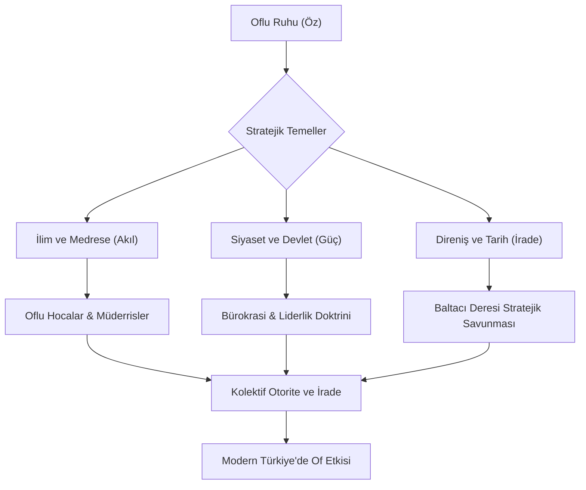



  
  
  # ⚓ OF-CODE: Otorite ve İrade
  
  
  
  
  > **"Of bir ilçe değil, bir dünya görüşüdür; bir duruş, bir itiraz ve nihayetinde bir idaredir."**
  
  Karadeniz’in en keskin zekâlı, en gelenekçi ve devlet yönetiminde en etkili noktalarında bulunan "Of" ruhunun tarihsel, sosyolojik ve stratejik dijital arşivi. Bu repository, sadece bir coğrafyayı değil; bir yönetim biçimini, sarsılmaz bir iradeyi ve asırlık bir eğitim geleneğini teknolojik standartlarla (Architecture-as-Code) kodlar. Burada her satır, coğrafyanın sertliğiyle harmanlanmış bir pratik zeka ürünüdür.

---

## 🧭 Proje Vizyonu: Bir Kimliğin Anatomisi

**OF-CODE**, antik çağların gizeminden modern Türkiye’nin bürokratik koridorlarına kadar Of’un geçirdiği muazzam dönüşümü mikroskobik ölçekte inceler. Of; ulemasıyla ilmi, siyasetçisiyle devleti, iş dünyasındaki sarsılmaz ağırlığıyla ekonomiyi ve kendine has "keskin, pragmatik ama otoriter" mizahıyla hayatı yorumlama biçimidir. 

Bu projenin temel vizyonu, sadece veri toplamak değil; bu bölgenin kendine özgü karakterini oluşturan **"Oflu Genomi"**sini ve kültürel kodlarını yapısal bir dille çözümlemektir. Gelecek nesillere bırakılacak olan, sadece bir soy ağacı değil; zorlu Karadeniz coğrafyasının insan iradesiyle nasıl bir "Devlet Hafızası"na dönüştüğünün kurumsal zeka mirasıdır. Of, bir yerleşim birimi olmaktan ziyade, toplumsal bir direncin ve yönetimsel bir dehanın haritasıdır.

---

## 🏛️ Mimari Akış: İrade Zinciri

---

## 📂 Repository Mimarisi: Bilgi Katmanları

Aşağıdaki dizinler projenin ana omurgasını oluşturmakta olup, her biri Of'un farklı bir "uzmanlık ve otorite" alanını derinlemesine temsil eder:

*   [**📜 01_İlim_Hafizasi/**](01_Ilim_Hafizasi/) - Bölgenin "Şark'ın ve Karadeniz'in Medresesi" olarak anılmasını sağlayan derin ilmi geçmişi. Burada sadece dini metinler değil, toplumsal nizamı kuran hukuk kuralları ve icazet sisteminin disiplini yer alır.
*   [**🏛️ 02_Siyaset_Laboratuvari/**](02_Siyaset_Laboratuvari/) - Devlet mekanizmasındaki "Oflu Ağırlığı"nın anatomisi. Bakanlar, müsteşarlar, genel müdürler ve Türk bürokrasisindeki "Oflu Kadroculuk" geleneğinin sosyolojik analizi.
*   [**⚔️ 03_Milli_Mucadele/**](03_Milli_Mucadele/) - 1916 Rus işgalinden Kurtuluş Savaşı'na kadar bölgenin sergilediği stratejik savunma doktrini. Baltacı Deresi'nin her bir taşına sinmiş olan bağımsızlık iradesi.
*   [**🌊 04_Sosyal_Yapi/**](04_Sosyal_Yapi/) - Mikrososyobiyolojik bir inceleme. Oflu kimliğinin oluşumundaki aile hiyerarşileri, sülale yapıları (Sarıalioğlu, Çakıroğlu ve diğerleri), lakaplar ve Karadeniz pragmatizminin kökenleri.
*   [**📖 05_Of_Lügatı/**](05_Of_Lugati/) - Of ağzının matematiksel grameri. Kendine has deyimler, 'racon' kuralları, sözlü kültür mirası ve karşısındakini tek cümlede mat eden o meşhur hazırcevaplık sanatı.

---

## 🏛️ Stratejik Odak Noktaları: Derin Analiz

### 📜 Ulema ve Eğitim Mirası (İlim Şehri Of)

Of, Osmanlı klasik döneminden Cumhuriyet'e kadar Karadeniz’in en prestijli ilim havzası olmuştur. Of medreseleri, sadece kurra hafızlar değil, aynı zamanda toplumun her kesimine hükmeden, adaleti tesis eden hukukçular (müftüler, kadılar) ve sosyal barışı sağlayan kanaat önderleri yetiştirmiştir.

*   **Oflu Hocalar Fenomeni:** Bölge insanının karakteristik özelliklerini (cesaret, zeka, otorite) dini bilgiyle birleştiren efsanevi isimler. Hazırcevaplılıkları, halkın anlayacağı dilden verdikleri keskin fetvalar ve toplumu dönüştürme güçleri.
*   **İcazet ve Disiplin:** En ücra dağ köylerinde, çay bahçelerinin gölgesinde dahi sönmeyen bir ilim meşalesi. Bu sistemin yetiştirdiği zihinlerin modern akademiye ve bürokrasiye nasıl entegre olduğunun izleği.

### 🎖️ Siyaset ve Devlet Hafızası (Ankara'daki Of)

Türk siyasi tarihinde "Oflu" kavramı, güvenilirliğin, sadakatin ama aynı zamanda sarsılmaz bir yönetme iradesinin sembolüdür. Of, Türkiye Cumhuriyeti'nin yönetim şemasında en çok ismi bulunan, devletin "çelik çekirdeği" olarak tabir edilebilecek kritik noktalarda görev alan bir insan kaynağı deposudur.

*   **Yönetim Doktrini:** İçişlerinden savunmaya, enerjiden adalete kadar devletin omurgasını oluşturan kurumları yöneten Oflu devlet adamlarının ortak yönetim karakteri: Kararlılık ve çözüm odaklılık.
*   **Network ve Dayanışma:** Köklü sülale yapılarının devlet geleneğiyle birleşmesi sonucu oluşan "Of Lobisi"nin, aslında bir "Liyakat ve Sadakat Ağı" olarak nasıl işlediğinin sosyolojik incelemesi.

### ⚔️ Direnişin Tarihi: Baltacı Deresi Destanı

Of tarihinin en şanlı sayfası, düşman çizmesine karşı gösterilen o muazzam mukavemettir. 1916 yılında, Rus İmparatorluğu'nun devasa ordusuna karşı sergilenen direniş, sadece bir bölge savunması değil, bir halkın topyekün varoluş mücadelesidir.

*   **110 Günlük Epik Savunma:** Baltacı Deresi hattında, hiçbir düzenli ordu desteği olmadan, sadece yerel milislerin (kadın, erkek, yaşlı, çocuk) kendi imkanlarıyla, av tüfekleriyle ve sarsılmaz imanlarıyla koca bir orduyu durdurduğu o tarihi kesit.
*   **Gerilla Taktikleri ve Zeka:** Coğrafi avantajı pratik askeri zekayla birleştiren, Rus generallerini dahi hayrete düşüren lojistik ve stratejik hamlelerin teknik analizi. Of'un, bir işgal ordusuna "Geçit Yok!" dediği o kutsal toprakların hikayesi.

---

## 📉 Tarihsel Kilometre Taşları: Zaman Çizelgesi

| Zaman | Olay | Stratejik Önem |
| --- | --- | --- |
| **1461** | Osmanlı Fethi | Of'un Trabzon ile birlikte Osmanlı mülküne girişi ve Karadeniz'in ilim kapısı haline gelmesi. |
| **1600-1800** | Altın Çağ | Medrese sayısının zirveye ulaşması, "Şeyhülislamlar Diyarı" olarak anılmaya başlanması. |
| **1916** | Baltacı Direnişi | Halkın, düzenli ordulardan daha etkili bir şekilde vatan toprağını savunuşunun dünya tarihine kaydı. |
| **1950+** | Demokratik Hamle | Oflu ailelerin ve siyasetçilerin merkez sağ ve devlet kademelerinde mutlak otorite kurmaya başlaması. |
| **2024+** | Dijital Miras | OF-CODE ile bu muazzam tarihin ve karakterin teknolojiyle geleceğe taşınması. |

---

## 🛠️ Katkı Sağlama: Bir Mirası İnşa Etmek

Bu repository, yaşayan bir organizmadır. Elinizdeki belgeleri, hafızanızdaki hikayeleri ve atalarınızdan kalan kültürel kodları buraya ekleyerek bu devasa arşive katkıda bulunabilirsiniz. Detaylar için: [CONTRIBUTING.md](CONTRIBUTING.md)

---

## 👨‍💻 Geliştirici Hakkında

**Bahattin Yunus Çetin**  
*IT Architect / Stratejik Teknoloji Uzmanı*

Trabzon'un kalbi Of'ta kök salan, akademik titizliği teknolojik vizyonla birleştiren bir BT Mimarı. Bu proje, "Oflu" kimliğinin getirdiği o fıtri yönetim becerisini ve analitik düşünce yapısını, modern yazılım ve dökümantasyon dünyasına (Architecture-as-Code) tercüme etme misyonudur.

---

## 📢 Motto

> **"Her yer Of, ama sadece Of merkezdir. Çünkü otorite yerinde, irade derindedir."**

---

  
  
<i>Otorite ve İrade Arşivi - Milli Hafıza Merkezi - 2026</i>

