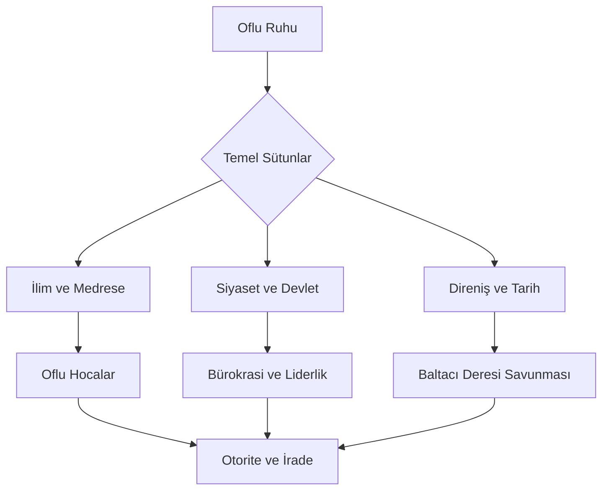
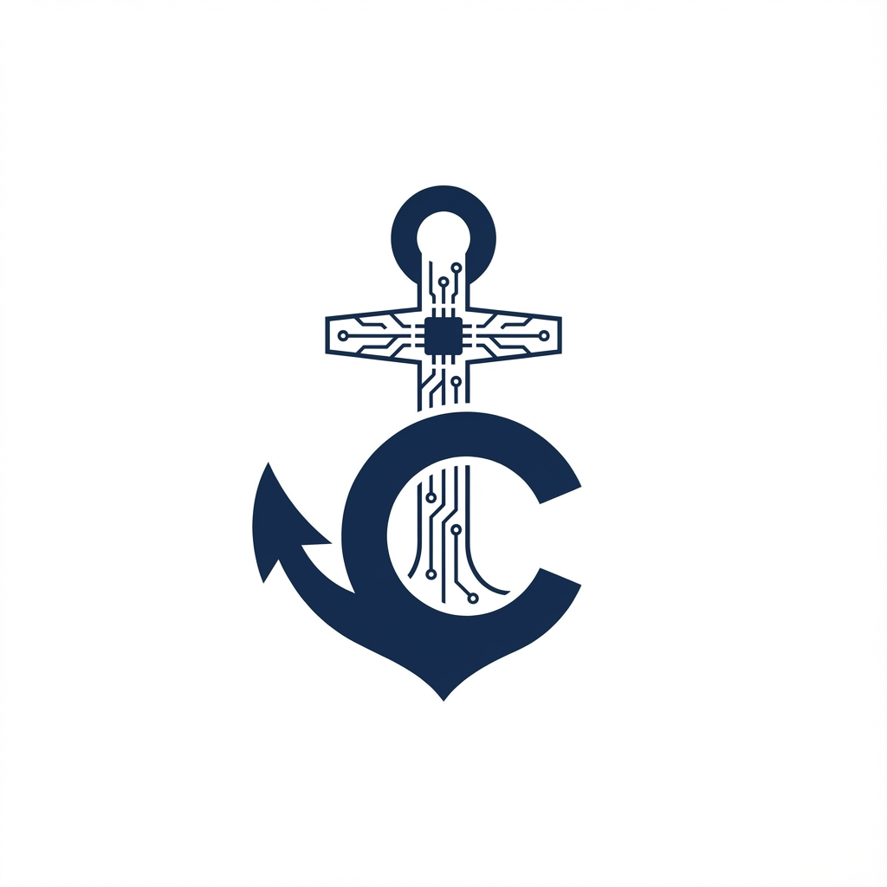



  
  
  # ⚓ OF-CODE: Otorite ve İrade
  
  
  
  
  > **"Of bir ilçe değil, bir dünya görüşüdür."**
  
  Karadeniz’in en keskin zekâlı, en gelenekçi ve devlet yönetiminde en etkili noktalarında bulunan "Of" ruhunun tarihsel, sosyolojik ve stratejik dijital arşivi. Bu repository, sadece bir coğrafyayı değil; bir yönetim biçimini, bir iradeyi ve asırlık bir eğitim geleneğini kodlar.

---

## 🧭 Proje Vizyonu

**OF-CODE**, antik çağlardan modern Türkiye’ye kadar Of’un geçirdiği dönüşümü derinlemesine inceler. Of; ulemasıyla, siyasetçisiyle, iş dünyasındaki sarsılmaz ağırlığıyla ve kendine has "pratik ama otoriter" mizahıyla bir bölgenin nasıl bir küresel "marka" haline geldiğinin kanıtıdır. Projenin temel amacı, bu bölgenin kendine özgü karakterini oluşturan genetik ve kültürel kodları çözümlemek, gelecek nesillere "Oflu" olmanın ötesinde bir "kurumsal zeka" mirası bırakmaktır. Of, bir yerleşim birimi olmaktan ziyade, zorlu coğrafyanın insan iradesiyle nasıl şekillendirildiğinin en somut örneğidir.

---

## 🏛️ Mimari Akış

---

## 📂 Repository Mimarisi

Aşağıdaki dizinler projenin ana omurgasını oluşturmakta olup, her biri Of'un farklı bir uzmanlık alanını temsil eder:

*   [**📜 01_İlim_Hafizasi/**](01_Ilim_Hafizasi/) - Bölgenin "Karadeniz'in Medresesi" olarak anılmasını sağlayan derin ilmi geçmişi, müderrisler ve icazet sistemi.
*   [**🏛️ 02_Siyaset_Laboratuvari/**](02_Siyaset_Laboratuvari/) - Devlet mekanizmasındaki Oflu ağırlığının analizi, bakanlar, müsteşarlar ve kadroculuk geleneği.
*   [**⚔️ 03_Milli_Mucadele/**](03_Milli_Mucadele/) - Rus işgalinden Kurtuluş Savaşı'na kadar bölgenin stratejik savunma doktrini ve Baltacı Deresi efsanesi.
*   [**🌊 04_Sosyal_Yapi/**](04_Sosyal_Yapi/) - Mikrososyobiyolojik bir inceleme olarak Oflu kimliği, aile ağaçları, lakaplar ve Karadeniz pragmatizmi.
*   [**📖 05_Of_Lügatı/**](05_Of_Lugati/) - Of ağzının grameri, kendine has deyimler, 'racon' kuralları ve sözlü kültür mirası.

---

## 🏛️ Stratejik Odak Noktaları

### 📜 Ulema ve Eğitim Mirası (Medreseler Şehri)

Of, Osmanlı döneminden itibaren Karadeniz’in en önemli ilim merkezlerinden biri olmuştur. Bölgedeki medrese kültürü, sadece dini eğitimle sınırlı kalmamış, aynı zamanda sosyal adaleti sağlayacak hukukçuları ve topluma yön verecek kanaat önderlerini yetiştirmiştir.

*   **Oflu Hocalar:** Bölgenin dini ve sosyal hayatına yön veren, kendine has üslubuyla, hazırcevaplılığıyla ve "fetva" verme cesaretiyle tanınan alimlerin biyografileri ve etkileri.
*   **Eğitim Geleneği:** En ücra köylerden dahi çıkan medrese kültürü, zor şartlarda ilim tahsil etme azmi ve bu geleneksel yapının modern akademik dünyaya entegrasyon süreçleri.

### 🎖️ Siyaset ve Devlet Hafızası

Türkiye’de "Oflu" denildiğinde akla ilk gelen alanlardan biri bürokrasi ve siyasettir. Of, Türkiye Cumhuriyeti'nin yönetim kademelerine en çok isim veren, devletin kritik virajlarında aktif rol oynayan bir insan kaynağı havuzudur.

*   **Bakanlar ve Liderler:** İçişlerinden adalete, ekonomiden orman yönetimine kadar devletin en stratejik kurumlarını yöneten Oflu devlet adamlarının yönetim anlayışları.
*   **Yerel Güç Dengeleri ve Network:** Köklü aile yapılarının Ankara nezdindeki temsiliyeti, "Of Lobisi"nin işleyiş mekanizması ve bu etkinin ülkenin kalkınmasındaki sosyolojik izdüşümleri.

### ⚔️ Direnişin Tarihi: Baltacı Deresi

Of tarihi, sadece kalemle değil, aynı zamanda kılıçla da yazılmıştır. 1916 yılındaki Rus işgali sırasında sergilenen direniş, dünya savaş tarihine geçecek kadar organize ve inançlı bir halk hareketidir.

*   **110 Günlük Direniş (1916):** Of halkının Baltacı Deresi mevkisinde devasa Rus ordusuna karşı sergilediği, cephe gerisinde kadın-erkek ayrımı olmaksızın yürütülen destansı müdafaa.
*   **Milis Kuvvetler ve Strateji:** Hiçbir nizami ordu desteği almadan, tamamen yerel imkanlarla ve zekice kurgulanmış gerilla taktikleriyle büyük bir imparatorluk ordusunun nasıl durdurulduğunun teknik analizi.

---

## 📉 Tarihsel Kilometre Taşları

| Tarih | Olay | Önemi |
| --- | --- | --- |
| **1461** | Osmanlı Fethi | Fatih Sultan Mehmet'in fethiyle birlikte bölgenin stratejik konumu ve İslamlaşma-ilim sürecinin başlangıcı. |
| **1911-1918** | Milli Mücadele | Rus işgaline karşı "Vatan-ı Sani" (İkinci Vatan) bilinciyle yapılan bölgesel savunma ve kurtuluş. |
| **1950-2024** | Ankara Ağırlığı | Çok partili dönemle birlikte Oflu bürokrat ve siyasetçilerin merkezi yönetimdeki domine edici etkisinin zirve yapması. |

---

## 🛠️ Katkı Sağlama

Bu dijital arşivin genişlemesi, doğru bilgi ve belgelerin toplanmasına bağlıdır. Of tarihine dair bilgi eklemek için lütfen [CONTRIBUTING.md](CONTRIBUTING.md) dosyasını inceleyin.

---

## 👨‍💻 Geliştirici Hakkında

**Bahattin Yunus Çetin**  
*IT Architect / Akademik Araştırmacı*

Trabzon'un Of ilçesinde eğitim hayatını sürdüren ve teknoloji ile kültürel mirası harmanlamayı vizyon edinen bir BT Mimarı. Bu proje, bölgenin tarihsel otoritesini modern dokümantasyon standartlarıyla (Architecture-as-Code) birleştirme çabasının bir ürünüdür.

---

## 📢 Motto

> **"Her yer Of, ama sadece Of merkezdir."**

---

  
  
<i>Otorite ve İrade Arşivi - 2026</i>

