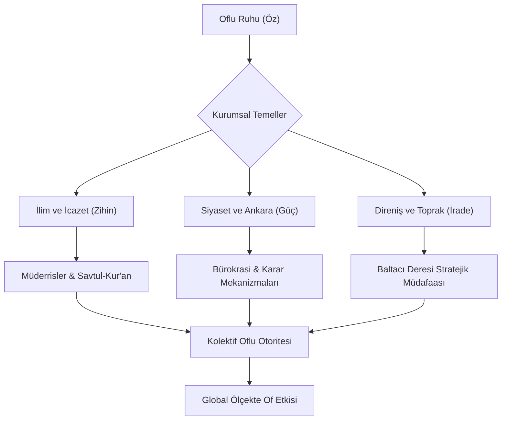

  
  
  # ⚓ OF-CODE: Otorite, İlim ve Üstün İrade
  
  
  
  
  > **"Of bir coğrafya değil, bir dünya görüşüdür; bir duruş, bir itiraz ve nihayetinde bir idaredir. Of merkezleşmiş bir irade, aklın direnişe dönüştüğü yegâne noktadır."**
  
  Karadeniz’in en keskin zekâlı, en gelenekçi ve devlet yönetiminde en etkili noktalarında bulunan "Of" ruhunun tarihsel, sosyolojik ve stratejik dijital arşivi. Bu repository, sadece bir yerleşkeyi değil; bir yönetim doktrini, sarsılmaz bir iradeyi ve asırlık bir eğitim geleneğini çağdaş teknolojik standartlarla (Architecture-as-Code) gelecek asırlara mühürler. Burada kodlanan her veri, Karadeniz’in sert rüzgarıyla bilenmiş bir pratik zeka ürünüdür.

---

## 🧭 Proje Vizyonu: Oflu Genomunun Şifreleri

**OF-CODE**, antik çağların gizeminden modern Türkiye’nin bürokratik koridorlarına kadar Of’un geçirdiği muazzam dönüşümü, bir bölgenin nasıl "Devlet İçinde Devlet, Hafıza İçinde Tarih" haline geldiğini akademik ve sosyolojik titizlikle inceler. Of; ulemasıyla ilmi otoriteyi, siyasetçisiyle devletin çelik çekirdeğini, iş dünyasındaki sarsılmaz ağırlığıyla ekonomik pragmatizmi ve kendine has "keskin, hazırcevap ve otoriter" mizahıyla hayatın bizzat kendisini tanımlar.

Bu projenin temel vizyonu, yüzeysel bilgilerin ötesine geçerek **"Oflu Entelektüel Sermayesi"**ni ve kültürel kodlarını yapısal bir dille analiz etmektir. Of, bir ilçe olmanın çok ötesinde, toplumsal bir direncin ve yönetimsel bir dehanın dünya üzerindeki merkez üssüdür.

---

## 🏛️ Mimari Akış: Otoritenin Katmanları

---

## 📂 Repository Mimarisi: Stratejik Modüller

Aşağıdaki dizinler projenin ana omurgasını teşkil eder ve her biri Of'un birer "mükemmeliyet merkezi" olan uzmanlık alanlarını temsil eder:

*   [**📜 01_İlim_Hafizasi/**](01_Ilim_Hafizasi/) - "Karadeniz'in Al-Azhar'ı" olarak bilinen Of'un derin ilmi mirası. Sadece dini eğitim değil, toplumsal hukuku (Fıkıh) düzenleyen ulema disiplini ve icazet sisteminin kodları.
*   [**🏛️ 02_Siyaset_Laboratuvari/**](02_Siyaset_Laboratuvari/) - Devlet mekanizmasındaki "Oflu Ağırlığı"nın anatomisi. Bakanlar, müsteşarlar, genel müdürler ve Türk bürokrasisindeki "Oflu Kadroculuk" geleneğinin sosyolojik analizi.
*   [**⚔️ 03_Milli_Mucadele/**](03_Milli_Mucadele/) - 1916 Rus işgaline karşı serpilen "Milis İradenin" teknik dokümanları. Baltacı Deresi'nde durdurulan imparatorluk ordusunun ve o günkü gerilla taktiklerinin dökümü.
*   [**🌊 04_Sosyal_Yapi/**](04_Sosyal_Yapi/) - Mikrososyobiyolojik bir analiz: Sülale Federasyonları. Sarıalioğulları, Çakıroğulları, Nuhoğulları ve diğer büyük ailelerin toplumsal hiyerarşideki rolleri ve "Ağalık" kurumunun modern izdüşümleri.
*   [**📖 05_Of_Lügatı/**](05_Of_Lugati/) - Of ağzının matematiksel ve pratik grameri. Karşısındakini tek bir hazırcevapla "bypass" eden linguistik sanat, bölgeye özgü deyimler ve racon kuralları.

---

## 🏛️ Stratejik Odak Noktaları: Derinlemesine Of

### 📜 Ulema ve Eğitim Mirası: Medreseler Şehri

Of, Osmanlı klasik döneminden bugüne Karadeniz’in en prestijli "İlmi Havzası" olmuştur. Of medreseleri, sadece kurra hafızlar değil, aynı zamanda toplumun her kesimine hükmeden, adaleti tesis eden hukukçular (müftüler, kadılar) ve sosyal barışı sağlayan kanaat önderleri yetiştirmiştir. "Of'ta her ev bir medresedir" sözü, bu bölgenin bilgiye olan genetik bağlılığını özetler.

*   **Ulema Disiplini:** Köy odalarından çıkan dünya çapındaki alimlerin yetişme şartları, Savtul-Kur'an geleneği ve icazetin sarsılmaz ağırlığı.
*   **Sosyal Hukuk:** Oflu hocaların sadece camide değil, pazarda, tarlada ve devlet katında çözüm üreten "Fıkhi Pratikliği".

### 🎖️ Siyaset ve Devlet Hafızası: Karar Odası Of

Türkiye Cumhuriyeti'nin yönetim şemasında "Of" bir imzadır. Of; güvenin, sadakatin ve sarsılmaz yönetme iradesinin kalesidir. Devletun en kritik virajlarında dümende hep bir Oflu’nun olması tesadüf değil, bir yönetim doktrininin sonucudur.

*   **Oflu Lobisi ve Liyakat:** Ankara’daki "Of Gücü"nün aslında bir "Güven ve Dayanışma Ağı" olarak nasıl işlediği, devletin bekası için alınan kararlardaki Oflu imzası.
*   **İdari Üstünlük:** Sadece siyaset değil, sendikalardan spor kulüplerine, sivil toplumdan iş dünyasına kadar her alanda kurulan "İdari Hakimiyet".

### ⚔️ Direnişin Tarihi: 110 Günlük Baltacı Deresi Destanı

1916 yılındaki Rus işgalinde sergilenen direniş, dünya savaş tarihindeki en büyük "Halk Mukavemeti" örneklerinden biridir. Koca bir İmparatorluk ordusu, düzenli bir askeri güç karşısında değil; tüfeğini kapan köylünün, ulemanın ve kadının kurduğu "İrade Hattı" karşısında durmak zorunda kalmıştır.

*   **Stratejik Müdafaa:** Zisino (Bölümlü) ve Baltacı Deresi hattında kurulan doğal savunma mekanizmaları, gerilla tipi baskınlar ve Rus generallerini dahi hayrete düşüren lojistik zeka.
*   **Bağımsızlık Geni:** Hiçbir yerden emir beklemeden vatanını savunan "Doğuştan Asker" Oflu karakterinin tarihsel tescili.

---

## 📉 Tarihsel Kilometre Taşları: Otoritenin Takvimi

| Zaman | Olay | Stratejik Sonuç |
| --- | --- | --- |
| **1461** | Fatih'in Fethi | Bölgenin "İslam'ın ve İlmin Kalesi" olma yolundaki ilk büyük adımı. |
| **1600-1900** | İlim Çağı | Of'un, Osmanlı bürokrasisine en nitelikli ulemayı ihraç ettiği altın dönem. |
| **1916** | Baltacı Direnişi | "Vatan-ı Sani" (İkinci Vatan) bilinciyle toprağın milis kuvvetlerle mühürlenmesi. |
| **1950 - Günümüz** | Modern Otorite | Oflu liderlerin Türkiye'nin kaderini belirleyen makamlarda mutlak hakimiyeti. |
| **2026** | Dijital Miras | OF-CODE ile bu muazzam tarihin ve karakterin teknolojiyle geleceğe taşınması. |

---

## 🛠️ Katkı Sağlama: Bir Mirası İnşa Etmek

Bu repository, yaşayan bir organizmadır. Elinizdeki belgeleri, hafızanızdaki hikayeleri ve atalarınızdan kalan kültürel kodları buraya ekleyerek bu devasa arşive katkıda bulunabilirsiniz. Detaylar için: [CONTRIBUTING.md](CONTRIBUTING.md)

---

## 👨‍💻 Geliştirici Hakkında

**Bahattin Yunus Çetin**  
*IT Architect / Stratejik Teknoloji Laboratuvarı Kurucusu*

Trabzon'un kalbi Of'ta kök salan, akademik titizliği teknolojik vizyonla birleştiren bir BT Mimarı. Of'un o fıtri idare sanatını ve analitik zekasını, modern yazılım dünyasının dökümantasyon standartlarına (Architecture-as-Code) tercüme eden dijital bir köprü.

---

## 📢 Motto

> **"Her yer Of, ama sadece Of merkezdir. Çünkü otorite yerinde, irade ise en derindedir."**

---

  
  
<i>Otorite ve İrade Arşivi - Milli Hafıza ve Kültür Merkezi - 2026</i>

